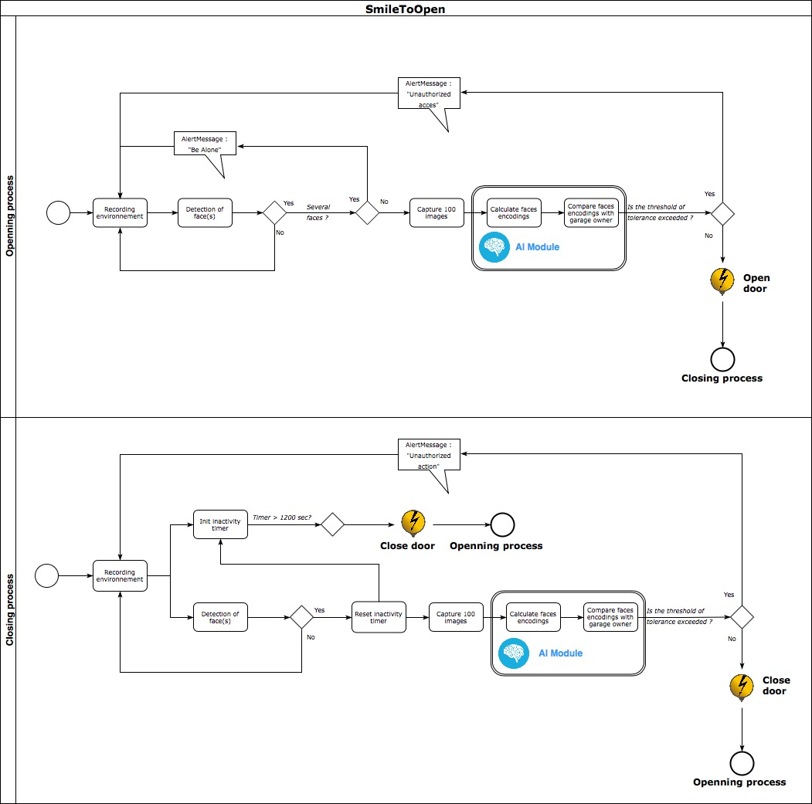

# SmileToOpen
DeepLearning pretrained network to handle face identification for garage door opening/closing.

## Project structure
* ```./images``` folder contains a picture of the face of the owner (only one is needed). If there is several owners, add one pic per owner in this folder.
* ```./test``` folder contains pictures of the environement. Pictures are refreshed all the time.

## Install
1. Edit crontab
You have to modify the crontab in order to launch the script every time your raspberry starts :
* ``` sudo crontab -e```
* add in it : ``` @reboot /your_path/recognize.sh```
2. Electrical connections
* GPIO pin 6 is used as a GROUND. See Figure 1.
* GPIO pin 7 is used as a positive output (+1.5V). See Figure 1.
* A 12V battery is used and a NPN transistor. See Figure 2
Figure 1, Raspberry pin board: 

## Processing flow
Figure 3, Processing flow: 


