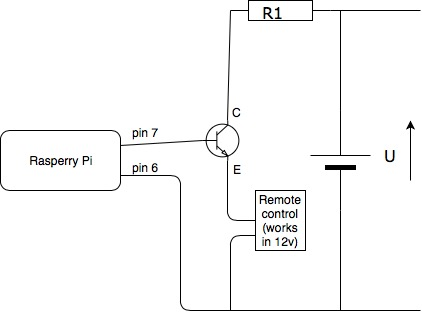
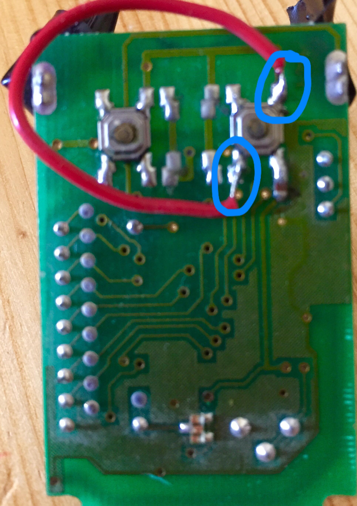

# SmileToOpen
DeepLearning pretrained network to handle face identification for garage door opening/closing.

## Project structure
* ```./images``` folder contains a picture of the face of the owner (only one is needed). If there is several owners, add one pic per owner in this folder.
* ```./test``` folder contains pictures of the environement. Pictures are refreshed all the time.

## Install
1. Edit crontab
You have to modify the crontab in order to launch the script every time your raspberry starts :
* ``` sudo crontab -e```
* add in it: ``` @reboot /your_path/recognize.sh```
2. Electrical connections
* GPIO pin 6 is used as a GROUND. See Figure 1.
* GPIO pin 7 is used as a positive output (+3.3V). See Figure 1.
* A 12V battery is used and a NPN transistor. See Figure 2
* Modify the remote controll electronic chip card in order to send the frequence when the remote controll has current (no need that the user press the correct button). See Figure 3.
Figure 1, Raspberry pin board: 
Figure 3, Electric diagram: 
Figure 3, Remote control: 

## Processing flow
Figure 4, Processing flow: 

## TODO
* Train my own NN like UNet
* Add an AO instead of the NPN transistor


